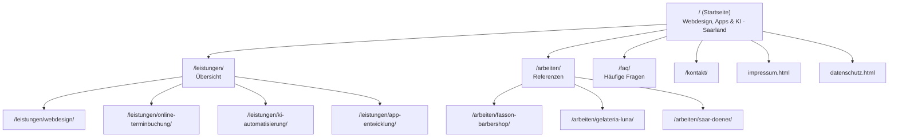

# Site-Architektur — tech-saar.de (lokales SEO)

*Erstellt: 2026-07-13 · Skill: `site-architecture` (marketingskills) · Basis: `.agents/product-marketing.md`*
*Site-Typ: Small Business / Local · Ziel: mehr lokale Anfragen im Saarland.*

## Ausgangslage
Aktuell ist tech-saar.de eine **Single-Page** (Hero → Problem → Leistungen → Arbeiten → Über uns → Kontakt) plus `impressum.html` und `datenschutz.html`. Das ist für Conversion gut, für **lokales SEO dünn**: Google hat nur eine indizierbare Inhaltsseite für viele unterschiedliche Suchintentionen (einzelne Leistungen, Ort, Preise, FAQ).

## Zielstruktur (schrittweiser Ausbau, kein Big-Bang)

## Empfohlene Reihenfolge & Begründung

### Phase 1 — hoher Hebel, wenig Aufwand
1. **`/faq/` (FAQ-Seite)** — beantwortet echte Suchintention („Was kostet eine Website?", „Wie lange dauert es?", „Bin ich gebunden?"), entkräftet die Top-Einwände aus `product-marketing.md` und ist **FAQPage-Rich-Result-fähig**. Doppelnutzen SEO + Conversion. *Alternativ zunächst als FAQ-Sektion auf der Startseite mit FAQPage-Schema.*
2. **Ort-Signal auf der Startseite** — „Namborn / Landkreis St. Wendel / Saarland" natürlich im Über-uns-/Kontaktbereich verankern (kein Keyword-Stuffing). Zahlt sofort auf lokale Rankings ein, ohne neue Seite.

### Phase 2 — Leistungs-Landingpages (je 1 URL pro Suchintention)
Je eine schlanke Seite pro Kern-Keyword, damit jede Suchintention eine passende Zielseite bekommt:
- `/leistungen/webdesign/` → „Webdesign Saarland", „Website erstellen lassen"
- `/leistungen/online-terminbuchung/` → „Online Terminbuchung Website"
- `/leistungen/ki-automatisierung/` → „KI Automatisierung KMU"
- `/leistungen/app-entwicklung/` → „App entwickeln lassen Saarland"

Jede Seite: eigenes `<title>`/Description, H1 mit Keyword+Region, konkreter Nutzen, ein CTA (Kontakt), interne Links zurück zu `/` und `/kontakt/`. So entsteht ein sauberer **Hub-and-Spoke** (Startseite = Hub, Leistungen = Spokes).

### Phase 3 — Referenz-/Case-Study-Seiten
Erst wenn echte Kundenfreigaben vorliegen: `/arbeiten/…` je Projekt (Branche + Ort im Titel, z. B. „Website für Barbershop in Saarbrücken"). Liefert branchen- und ortsspezifische Keywords + Vertrauensbeweis.

## URL- & Technik-Konventionen (zur bestehenden Repo-Struktur passend)
- **Verzeichnis-URLs mit `index.html`** je Unterordner (deckt sich mit eurer Repo-Konvention `projektname/index.html`), z. B. `leistungen/webdesign/index.html`. Saubere, sprechende URLs ohne `.html`.
- Jede neue Seite in **`sitemap.xml`** aufnehmen (nur kanonische Verzeichnis-URL, nicht zusätzlich die `…/index.html`-Variante — siehe Audit #4).
- **Breadcrumb-Navigation** auf Unterseiten + `BreadcrumbList`-Schema (Startseite › Leistungen › Webdesign).
- Konsistente Haupt-Navigation: „Leistungen" im Menü als Dropdown/Anker auf die neuen Seiten.
- **Interne Verlinkung:** Startseiten-Leistungstabelle verlinkt auf die jeweiligen `/leistungen/…`-Seiten; jede Unterseite verlinkt zurück auf Kontakt.

## Was NICHT tun
- Keine dünnen Doorway-Pages pro Nachbarort („Webdesign Ort X, Ort Y, Ort Z" als Klone) — das wertet Google ab. Stattdessen echte, unterschiedliche Inhalte + ein starkes Google-Unternehmensprofil.
- Keine `.html`-Duplikate zusätzlich zur Verzeichnis-URL in die Sitemap.

## Nächster Schritt
Phase 1 ist der beste Startpunkt (FAQ + Ort-Signal). Umsetzung ist **nicht Teil dieses Durchlaufs** — auf Zuruf baue ich die FAQ-Sektion inkl. FAQPage-Schema als konkreten nächsten Schritt.
